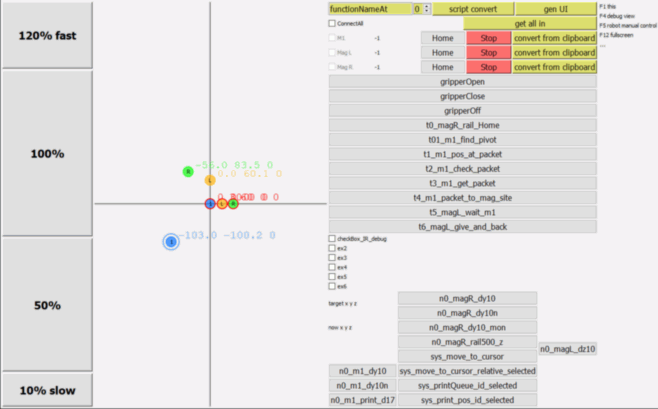

"dispenser_gift_py" - current in work

"dispenser_food_py" - is outdated



### About
Now this controls 1 Dobot M1 and 2 of Magician.  
This in commonly replaces Dobot Studio for M1 and Magician, can dispaly position, copy, sync, clear errors, display execution process, itc.
To create=save new buttons you can copy script from Dobot studio and click "convert from clipboard" or manually create files AND/OR folders in "script" folder

 
### install python libraries for Windows:

pip install PySide2

pip install pyserial

pip install pynput

pip install colorama

pip install pywin32 REM win32clipboard 


### UI  guide for "dispenser_gift_py":
- press keyboard 1,2,3 to select dobot
- click on map to set X,Y
- mouse wheel changes Z
- ctrl+wheel change r-axis
- shift+wheel change rail L
- left|rigrt alt+above - faster|slower
- c cursor to current pos
- Press F1 for key map
### Tips:
* SetArmOrientation is need to move with XYZ, but not with Joints
* 🐛 M1 still has buggy HOME  function at 2020. Do not HOME or you lost angle of r-axis. Use "INITIAL Position". Also replace battery if it deplated. You can use 18650+3.3v LDO
* Rail calibrates to 0 after each reboot with HOME button, to avoid M1 HOME bug, connect rail to Magician (but not to M1). Install rail's end-switch not far from position you need. Для многих сценариев не нужно двигать роботов по всей рельсе. Поэтому для ускорения процесса и экономии ресурса стоит придумать, как поставить концевой датчик рельсы ближе к центру, чтоб робот при калибровке не ездил в дальний конец
* before turn off Dobot with rail, set rail to desired initial position (will be 0 at next boot), so not need to start work with HOME next time to find rail 0.
* most functions in DobotDllType.py uses return with array wraping 'return [value]' , so use result as result[0] or dType.GetValue(api, id_)[0]
* if dobot not connected, some functions in DobotDllType.py looping endless. So need to skip while debugging


### Рекомендации при работе с dobot
* начать с определения, что роботы достают куда нужно
* составлять карту допустимых положений и припятствий (как рисует карту промобот).
* ограничивать скорость рельсы (может проскакивать почему-то в конце рельсы)
* тест проводить с минимальной нагрузкой (окно safe в M1 Studio  https://www.dobot.cc/online/help/dobot-m1/83.html ) тогда он сразу отключает мотор у ппрепятствия и ничего не ломает.
* автоматически сбрасывать ошибки, использовать функции перемещение по углам, а не координатам
* использовать имена, а не номер USB
* разработчики Dobot отвечают на email, на форуме - вяло и редко. В общих чертах, от китайских разработчиков не удалось ничего добится кроме того, что робот поддерживает то, что подерживает, а если нужно что-то более - как-нибудь самостоятельно. Вероятно поэтому распространено мнение, что dobot - для учёбы и развлечения.

### Краткая инструкция к софту:
видео вариант:  
текстом:  
скачать https://github.com/pavel-b-kr12/DoBot_multicontroll/tree/master/dispenser_gift_py
0. Подключить роботы в USB
1. запустить файл "_________________________run.bat"
2. К нопками 1,2,3 выбрать робота.  
 Перемещение КУРСОРА выбранного робота:  
 Клик на карте устанавливает координаты X,Y.  
 Колесо мыши = Z,   
 ctrl+Колесо = вращение r-оси  
 shift+Колесо = рельса  
3. Подвинуть робота в положение курсора скриптом (кнопкой) "cursor_to_pos" или всех роботов: "cursor_to_pos_all"
4. Скопировать координаты выделенного робота скриптом (кнопкой)  "print_pos_selected"
5. Вставить в .txt файл в папке "\script" - при следующем запуске он появится как кнопка.
  
2-5 б. Другой вариант - скопировать скрипт из dobot Studio и нажать "convert from clipboard" рядом с id робота которому этот скрипт предназначен


### TODO
* 🐛 fix alt-tab cause cant ctrl or shift+wheel 
* 🐛 fix stop cause cant resume

* fix clipboard deny error

* sw xyz/J
* convert xyz/J 2F^

* toggle auto upd pos from cursor
* upd coord, copy on click it

save rail at off

- [x] ask about function to check whether the next movement is good or will lead to error
https://forum.dobot.cc/t/check-possible-m1-movement-range-without-errors/3256
```
check possible M1 movement range without errors
Can you give me formulas or api function to check if next xyz is possible to reach or it will lead to error. Also I need function to full-automatic movement from possible point A to possible point B , without care of arm-orientation and other things.


How I imagine it:

xyz_now=GetPose(api, dobotId)

print( isMovementPossible(api, dobotId, xyz_now, xyz_next) )

print( isMovementPossible(api, dobotId, xyz_now, xyz_next, PTP_mode) )

print( get_distance_to_move_Rail_from_which_NextPosPossible(api, dobotId, xyz_now, xyz_next, PTP_mode) ) 
```

